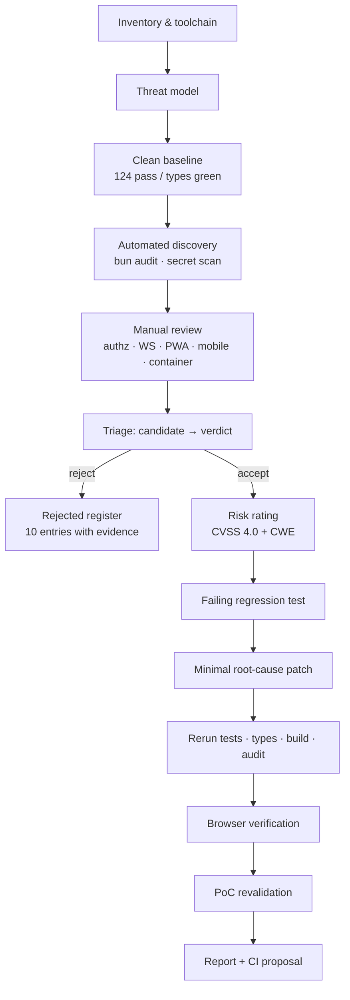
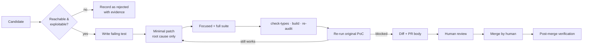

# litechat Security Audit

**Repository** `https://github.com/jhyunwoo/litechat` · **Branch** `main` · **Commit** `f52f085c4f757da2998660dc6029ba067bb50387`
**Assessment date** 2026-08-28 · **Method** authorised white-box review with local remediation

---

## Executive Summary

Full-repository audit of the litechat monorepo (Bun 1.3.14 + Turborepo; `apps/server`, `apps/web`, `apps/app`, `apps/dashboard`, `apps/lite`, `packages/types`, `e2e`) at commit `f52f085`.

**Eight findings** accepted: **2 High**, **3 Medium/Low with confirmed weakness**, **1 Low**, **2 Informational**. Six are remediated in this working tree with regression tests; two are documented recommendations left unimplemented.

| Severity | Count | Remediated |
|---|---|---|
| High | 2 | 2 |
| Medium | 2 | 2 |
| Low | 2 | 2 |
| Informational | 2 | 0 (documented) |

**Highest-risk attack path.** `LC-SEC-001` → an unauthenticated attacker rotates the `CF-Connecting-IP` header, resetting the rate-limit bucket on every request, and brute-forces `POST /api/admin/login` without limit. An admin session unlocks the analytics dashboard: per-user IP history, geolocation, MaxMind Insights (ISP/organisation), notification bodies and content reports — the densest PII in the system. This was reproduced in-repo, not theorised.

**Second path.** `LC-SEC-002` → `sharp` 0.33.5 carries four unpatched libvips CVEs and is reached with raw attacker bytes on `POST /api/images` before any format check. Compounded by `LC-SEC-004` (container ran as root), any decoder escape would have executed as uid 0 with write access to the whole image and the data volume.

**Overall.** The application's own authorisation logic is genuinely strong and was the most encouraging part of the review. Every conversation path funnels through `ChatService.requireMembership`; image access requires ownership or membership of a conversation the image appeared in; push and friend mutations scope by `user_id`; all SQL is parameterised with sort identifiers narrowed to literal unions at the route boundary; sessions are 256-bit CSPRNG tokens in Redis; passwords are argon2id. **No IDOR, no SQL injection, no XSS sink, and no real secret in the tree or in any reachable commit.** The defects found were concentrated at the trust boundary between the app and its reverse proxy, and in dependency/container hygiene — not in the business logic.

**Coverage caveat.** SAST, DAST, container scanning, IaC scanning and SBOM generation could **not** be run — the tooling is not installed on this host. Those are recorded as explicit gaps below with the exact commands, never as clean results.

---

## Repository and Attack Surface

| Component | Stack | Exposure |
|---|---|---|
| `apps/server` | Bun + Hono, SQLite (`bun:sqlite`), Redis (ioredis), sharp, maxmind, web-push | All HTTP/WS entry points |
| `apps/web` | React + Vite + Tailwind, PWA (workbox), react-router | `chat.moveto.kr` |
| `apps/lite` | Minimal client, no client JS analytics | `litechat.moveto.kr` |
| `apps/dashboard` | React + Vite, Google Maps, recharts | `dash.moveto.kr` (admin) |
| `apps/app` | Expo / React Native, expo-secure-store | iOS/Android |
| `packages/types` | Zod contracts shared by server and clients | — |

**Trust boundaries.** Internet → Traefik/Dokploy → single Bun process (Host-header routed) → SQLite volume + Redis. Two independent session namespaces: `lc_sess` (chat, `Domain=.moveto.kr`, Bearer or cookie) and `lc_admin_sess` (admin, host-only cookie, 12h). They share no prefix and cannot be interchanged — verified.

**Authentication model.** argon2id via `Bun.password`; 256-bit `crypto.getRandomValues` session tokens, base64url, stored in Redis with sliding expiry. Web uses httpOnly `SameSite=Lax` cookies; the native app stores the token in `expo-secure-store` with `WHEN_UNLOCKED_THIS_DEVICE_ONLY`. No CORS middleware is registered, so the browser same-origin policy is the outer boundary.

**Sensitive data.** Message content, uploaded images, per-session IP + geolocation + MaxMind Insights (ISP/organisation/user type), notification body previews, content reports.

---

## Methodology and Tool Coverage

| Method | Tool | Version | Scope | Result | Limitations |
|---|---|---|---|---|---|
| Manual code review | — | — | 175 source files; all server modules read in full | 8 findings | Primary method here |
| Dependency / SCA | `bun audit` | bun 1.3.14 | All workspaces vs `bun.lock` | 25 → 20 advisories | Skips non-default registries |
| Secret scanning | custom regex scanner | — | Working tree + **all** reachable commits | 0 real secrets | `gitleaks` unavailable; substitute has narrower rule coverage |
| Unit / integration | `bun test` | 1.3.14 | `apps/server` | 124 → **134 pass / 0 fail** | Only server + app have test scripts |
| Type checking | `tsc --noEmit` | TS 5.9.2 | 6 workspaces | Pass | The one repo-wide gate |
| Build | `turbo run build` | turbo 2.10.3 | web/lite/dashboard | Pass | — |
| Dynamic verification | Playwright + Chromium | 1.x | Web + dashboard driven live | 0 CSP violations; WS `OPEN` | Manual drive, not the e2e suite |
| SAST | CodeQL / Semgrep | — | — | **NOT RUN** | Not installed |
| DAST | OWASP ZAP | — | — | **NOT RUN** | Not installed; no authorised target |
| Container / image | Docker + Trivy | — | Dockerfile read manually | **NOT RUN** | No Docker runtime |
| IaC / config | Trivy config | — | — | **NOT RUN** | Not installed |
| SBOM | syft | — | — | **NOT RUN** | Not installed |
| E2E | Playwright suite | — | `e2e/` | **BLOCKED** (environmental) | Browser revision mismatch; identical at baseline |

---

## Prioritized Findings

| ID | Component | Finding | Status | Sev | CVSS 4.0 | CWE | Exploitability | Patch |
|---|---|---|---|---|---|---|---|---|
| LC-SEC-001 | server | Edge headers reset rate-limit bucket → unlimited login/admin brute force | CONFIRMED_EXPLOITABLE | **High** | 8.7 | 307, 290, 348 | Unauth, remote, deterministic | ✅ |
| LC-SEC-002 | deps | `sharp` 0.33.5 libvips CVEs reachable from image upload | CONFIRMED_WEAKNESS | **High** | n/a¹ | 1395 | Authenticated (open registration) | ✅ |
| LC-SEC-003 | server | Analytics IP taken from forgeable leftmost XFF entry | CONFIRMED_WEAKNESS | Medium | 5.3 | 348 | Unauth, remote | ✅ |
| LC-SEC-004 | infra | Container ran as root | CONFIRMED_WEAKNESS | Medium | 6.8 | 250 | Severity multiplier | ✅ |
| LC-SEC-005 | server | No Content-Security-Policy | CONFIRMED_WEAKNESS | Low | 3.1 | 693, 1021 | Defence in depth | ✅ |
| LC-SEC-006 | server | Unauthenticated analytics ingest unbounded | CONFIRMED_WEAKNESS | Low | 5.3 | 770 | Unauth, remote | ✅ |
| LC-SEC-007 | server | `exposeApiDocs` fails open if `NODE_ENV` ≠ `production` | LIKELY | Info | — | 1188 | Config-dependent | ⬜ |
| LC-SEC-008 | server | No dummy hash on unknown-username login | LIKELY | Info | — | 208 | Statistical | ⬜ |

¹ Upstream GHSA publishes no numeric score; rated High on demonstrated reachability with attacker-controlled decoder input.

---

## Per-Issue Details

### LC-SEC-001: Client-supplied edge headers reset the rate-limit bucket

**Status** CONFIRMED_EXPLOITABLE · **Severity** High · **CVSS 4.0** 8.7 `CVSS:4.0/AV:N/AC:L/AT:N/PR:N/UI:N/VC:H/VI:H/VA:N/SC:N/SI:N/SA:N` · **CWE** 307, 290, 348 · **Privileges** none

#### Description
`clientAddress()` built the rate-limit key from `CF-Connecting-IP`, falling back to `X-Forwarded-For`. Neither was validated against any notion of how many trusted proxies sit in front. Both are ordinary request headers any client can set. Because the header value *is* the bucket key, changing it per request allocated a fresh budget each time — the limiter counted correctly but always into a new bucket.

A second-order defect: with neither header present the key became the literal string `'unknown'`, collapsing every direct client into one shared bucket.

#### Location
`apps/server/src/middleware/rate-limit.ts:4-10` — consumed by `/api/auth/login` (20/15min), `/api/auth/register` (20/hr), `/api/admin/login` (5/15min).

#### Attack Path
`attacker sets CF-Connecting-IP: <fresh value>` → `clientAddress()` returns it unvalidated → `rate:admin-login:<fresh>` → counter starts at 1 → limiter never trips → `AdminRepo.findByUsername` + `Bun.password.verify` reached on every attempt.

#### Impact
Unlimited offline-speed credential guessing against the admin login, whose 5-attempt limit was the *only* control. Admin access exposes per-user IP history, geolocation, MaxMind Insights, notification previews and content reports.

#### Validation and PoC
```
40 × POST /api/admin/login with rotating cf-connecting-ip → 401, X-RateLimit-Remaining: 4
40 × POST /api/admin/login with fixed   cf-connecting-ip → 429
```
The rotating run never trips the limiter; `Remaining: 4` after 40 attempts shows the counter resetting each request. Post-patch the same PoC returns **429** with `Remaining: 0`.

#### Remediation
New `apps/server/src/client-address.ts` resolves the address from a configured trusted-proxy hop count:
- `X-Forwarded-For` is counted **from the right** — each proxy appends, so with N trusted hops the entry at `length - N` is what the nearest trusted proxy actually observed. Everything to its left is client-supplied and never read.
- `CF-Connecting-IP` is honoured only when `TRUST_CF_CONNECTING_IP=true`, since it is meaningful only if Cloudflare really is the edge.
- Fallback is the socket address, not a constant, so direct clients get distinct buckets.
- `TRUSTED_PROXY_HOPS=0` ignores forwarded headers entirely.

`middleware/rate-limit.ts` and `analytics/ip.ts` now share this one resolver, so the two call sites can no longer disagree.

#### Regression Tests
`apps/server/src/security-controls.test.ts` — two end-to-end rate-limit tests plus five `resolveClientAddress` unit cases. All failed before the patch (module absent) and pass after.

#### Residual Risk
`TRUSTED_PROXY_HOPS` must match the deployment. If the origin is reachable directly, bypassing Traefik, a forged single-entry XFF is still accepted — restrict origin ingress to the proxy at the network layer.

---

### LC-SEC-002: `sharp` 0.33.5 libvips CVEs reachable from image upload

**Status** CONFIRMED_SECURITY_WEAKNESS · **Severity** High · **CWE** 1395 · **Refs** GHSA `sharp <0.35.0`; CVE-2026-33327/33328/35590/35591

#### Description
`sharp` 0.33.5 bundles a libvips with four unpatched CVEs. This is not a dormant transitive dependency — it is on a request path fed raw attacker bytes.

#### Location / Attack Path
`POST /api/images` → `ImagesService.upload` → `sharp(original).metadata()` (`service.ts:54`) → `.rotate().resize().webp()` (`:62-66`).

The format allowlist (`FORMAT_INFO`) is applied to sharp's **output** at `:58`, i.e. *after* the decoder has already parsed untrusted input. Requires only a registered account, and registration is open.

#### Remediation
Upgraded `sharp` 0.33.5 → **0.35.4** in `apps/server` and `apps/app`. `bun audit` no longer reports sharp.

#### Regression Tests
`apps/server/src/modules/images/images.test.ts` — 8 pass on the new version; full suite 134 pass / 0 fail; builds pass.

#### Residual Risk
sharp 0.35.4 requires Node ≥20.9.0 while root `engines` still says `>=20`. The shipped container uses `oven/bun`, so this only affects non-container Node runs. Recommend tightening `engines`.

---

### LC-SEC-003: Analytics client IP taken from the forgeable leftmost XFF entry

**Status** CONFIRMED_SECURITY_WEAKNESS · **Severity** Medium · **CVSS 4.0** 5.3 · **CWE** 348

`clientIp()` returned `X-Forwarded-For.split(',')[0]` — by definition the client-supplied end of the chain. Any unauthenticated `POST /api/analytics/*` could write an arbitrary source IP into `analytics_sessions`, which then drives the admin map and sessions views and selects IPs for **paid** MaxMind Insights lookups.

Notably this contradicted the rate limiter, which read the *opposite* end of the same header — the same request could be two different clients depending on which module asked.

**Remediation** `clientIp()` now delegates to the shared `resolveClientAddress()`. **Location** `apps/server/src/modules/analytics/ip.ts:12-18`.

---

### LC-SEC-004: Container ran as root

**Status** CONFIRMED_SECURITY_WEAKNESS · **Severity** Medium · **CVSS 4.0** 6.8 · **CWE** 250

The runtime stage had no `USER` directive, so the server ran as uid 0 — directly compounding LC-SEC-002.

**Remediation** Runtime stage chowns `/app` to the image's existing `bun` user (uid/gid 1000) and sets `USER bun`; `docker-compose.yml` pins `user: '1000:1000'` so the data volume is owned correctly.

**Residual risk** Existing deployments have a root-owned `litechat-data` volume and need a one-time `chown -R 1000:1000`. **Unverified at runtime — no Docker on the audit host.** This is the one patch not empirically validated; build and run it before deploying.

---

### LC-SEC-005: No Content-Security-Policy

**Status** CONFIRMED_SECURITY_WEAKNESS · **Severity** Low · **CWE** 693, 1021

`secureHeaders()` was called with no arguments; hono's defaults do **not** include CSP. Confirmed empirically — the emitted header set had no `Content-Security-Policy`.

Honestly scoped: there is **nothing to exploit today**. A sweep of all 175 source files found no `dangerouslySetInnerHTML`, `innerHTML`, `eval`, or `new Function`. This is defence in depth for a future injection bug, plus modern framing protection.

**Remediation** Explicit CSP: `default-src 'self'`, `object-src 'none'`, `frame-ancestors 'none'`, `base-uri 'self'`, `form-action 'self'`; `script-src` carries no `unsafe-inline`/`unsafe-eval`; the `/docs` jsDelivr origin is included **only** when `exposeApiDocs` is true, so production never widens `script-src` for a disabled page.

**Browser-verified** (this is a live-traffic header, so it was driven, not reasoned about): web app and dashboard loaded in Chromium, registration via in-page `fetch` → 201, authenticated WebSocket → **OPEN** under `connect-src 'self'`, service worker registered, **0 CSP violations** on either origin.

**Residual risk** `style-src` retains `'unsafe-inline'` for Tailwind runtime styles.

---

### LC-SEC-006: Unauthenticated analytics ingest unbounded

**Status** CONFIRMED_SECURITY_WEAKNESS · **Severity** Low · **CWE** 770

`/api/analytics/{session,event,vitals}` are intentionally unauthenticated (pre-login visitors are in scope) but had no limit, and for the `app` platform the server trusts body-supplied `visitorId`/`sessionId` as row keys. Anonymous requests could grow `analytics_*` without bound on the SQLite volume.

**Remediation** The existing `rateLimit` middleware now covers the whole analytics router at 240 req / 10 min per resolved address — well above real client volume (a few events per session).

**Residual risk** Body-supplied identifiers are still trusted for the cookie-less app platform; a client can fabricate its own identifiers within the budget.

---

### LC-SEC-007 / LC-SEC-008 (Informational, not changed)

- **LC-SEC-007** `config.ts:87` — `exposeApiDocs` is true whenever `NODE_ENV !== 'production'`, so an unset variable exposes `/openapi.json` and `/docs`. The shipped `Dockerfile:31` sets `NODE_ENV=production`, so the deployed default is closed. Recommend inverting to explicit opt-in.
- **LC-SEC-008** `auth/service.ts:40-46` — `login` returns early when the user row is absent, skipping argon2id and creating a large timing gap. Marginal value: `GET /api/friends/search` already discloses usernames to authenticated users. Recommend verifying against a fixed dummy hash.

---

## Rejected / Non-Exploitable Findings

Kept deliberately, so false positives leave an audit trail.

| ID | Source | Subject | Verdict | Evidence |
|---|---|---|---|---|
| REJ-01 | bun audit | `hono <4.12.34` (4 advisories) | NOT_EXPLOITABLE | Cover CORS middleware, JSX `memo()` SSR, proxy helper, language middleware. Grep found **no** use of `hono/cors`, `hono/jsx`, `memo()`, `hono/proxy`, `languageDetector`. Upgraded to 4.13.5 anyway. |
| REJ-02 | bun audit | react-router RSC CSRF | NOT_EXPLOITABLE | Vite SPAs; RSC mode not enabled, no server-side react-router. |
| REJ-03 | bun audit | image-size, js-yaml, brace-expansion, nanoid, postcss, fast-uri, uuid | NOT_EXPLOITABLE | All arrive via eslint/expo/jest/vite tooling. None on a request path. |
| REJ-04 | manual | Path traversal in static serving | FALSE_POSITIVE | `static.ts:61-62` decodes **before** testing `..`, so `%2e%2e` is caught; WHATWG URL parsing already normalises literal `../`. Ordering is correct. |
| REJ-05 | manual | Admin CSRF | NOT_EXPLOITABLE | `lc_admin_sess` is `SameSite=Lax` + host-only; JSON routes need a Content-Type simple forms cannot set. |
| REJ-06 | manual | SQL injection in dashboard queries | FALSE_POSITIVE | All values bound with `?`. Only `sort`/`dir` are interpolated, narrowed to literal unions at `admin/routes.ts:226,271`. |
| REJ-07 | manual | SSRF in GeoIP updater / Insights | FALSE_POSITIVE | Hardcoded MaxMind hosts; Insights validates via `node:net` `isIP()` first. Only the path varies. |
| REJ-08 | manual | IDOR on chat/images/push/friends | FALSE_POSITIVE | `requireMembership` on every conversation path; `canAccess` requires ownership or conversation membership; push/expo deletes scoped by `user_id`; `respond` checks `addressee_id`; image IDs are UUIDs. |
| REJ-09 | manual | SW caching authenticated responses | FALSE_POSITIVE | `sw.ts` only precaches `__WB_MANIFEST`. No runtime caching strategy registered. |
| REJ-10 | secret scan | password matches in test files | FALSE_POSITIVE | All are the synthetic fixture literal. Tracked `.env.*` hold only `EXPO_PUBLIC_*` URLs. Full-history scan across all reachable commits found no real credential. |

---

## Coverage Gaps and Unverified Assumptions

Never silently downgraded to "no vulnerability".

| Gap | Reason | Command to close it |
|---|---|---|
| SAST | Not installed | `semgrep --config p/typescript --config p/owasp-top-ten --sarif -o security/semgrep.sarif .` |
| Secret scanning | `gitleaks` absent; substituted a custom regex scanner over tree + full history | `gitleaks detect --source . --log-opts '--all' --report-path security/gitleaks.json` |
| Container scan | No Docker runtime — **LC-SEC-004's fix is unverified at runtime** | `docker build -t litechat:f52f085 . && trivy image --severity HIGH,CRITICAL litechat:f52f085` |
| IaC scan | Not installed | `trivy config --severity HIGH,CRITICAL .` |
| DAST | Not installed; no authorised target scope supplied | `zap-baseline.py -t $DAST_BASE_URL -r security/zap-baseline.html` |
| SBOM | Not installed | `syft dir:. -o cyclonedx-json=security/sbom.cdx.json` |
| E2E suite | Expects `chromium_headless_shell-1228`; host cache has `-1234`. **Reproduced identically at the pristine baseline with all changes stashed — not a regression from this work.** | `cd e2e && bunx playwright install chromium && bunx playwright test` |
| Mobile dynamic | No emulator; token storage / deep links / OTA reviewed statically | MASTG dynamic suite on a device |

**Unverified assumptions.** (1) Traefik is the only hop and appends to XFF — `TRUSTED_PROXY_HOPS=1` depends on it. (2) The origin is not directly reachable, bypassing Traefik. (3) Redis is reachable only from the compose network (it holds every session token; it has no password). (4) 20 residual `bun audit` advisories are dev/build-time only — argued from dependency paths, not proven by runtime instrumentation.

---

## Remediation Roadmap

**Immediate (done here)** — LC-SEC-001, 002, 003, 004, 005, 006.

**Before deploy** — Set `TRUSTED_PROXY_HOPS` to match the real chain (`1` for Traefik; `TRUST_CF_CONNECTING_IP=true` only if Cloudflare is genuinely the edge). Build the image and confirm non-root startup; `chown -R 1000:1000` the existing `litechat-data` volume. Verify the CSP against production Google Maps traffic on the dashboard.

**Near term** — LC-SEC-007 (invert docs default to opt-in) and LC-SEC-008 (dummy hash). Add a Redis password. Digest-pin `oven/bun:1.3`. Tighten root `engines` to `>=20.9.0`.

**Hardening** — Restrict origin ingress to the proxy at the network layer, closing LC-SEC-001's residual risk. Stop trusting body-supplied analytics identifiers. Add `--no-same-owner` to the GeoIP `tar` extraction.

**Testing** — `apps/web`, `apps/dashboard`, `apps/lite` and `packages/types` have **no** test script; `turbo run test` covers only server + app. `lint` exists only in `apps/app`. Fix the e2e browser pin.

---

## CI/CD Security Integration

There is **no** `.github/` directory — any CI is greenfield (confirmed at this commit).

**PR fast lane** — `bun install --frozen-lockfile`; `bun run check-types` (the one repo-wide gate); `bun test`; changed-code SAST; current-tree secret scan; `bun audit`; IaC scan.

**Main / nightly** — full SAST; full SCA; **full-history** secret scan; container build + image scan; bounded property tests; Playwright e2e; ZAP baseline against an ephemeral target.

**Scheduled deep** — authenticated active DAST on an isolated target; longer fuzz campaigns; threat-model refresh.

**Policy** — start new scanners advisory-only to establish a baseline, then fail PRs on newly-introduced Critical/High; never expose scan credentials to fork PRs; least-privilege job permissions; pin external actions by SHA; sanitise uploaded reports.

---

## Workflow Diagram



## Remediation Pipeline Diagram



---

## Verification Record

| Gate | Baseline | After remediation |
|---|---|---|
| `bun test` (server) | 124 pass / 0 fail | **134 pass / 0 fail** |
| `bun run check-types` | 6/6 pass | **6/6 pass** |
| `bun run build` | 3/3 pass | **3/3 pass** |
| `bun audit` | 25 advisories | **20** (sharp + all hono cleared) |
| Original LC-SEC-001 PoC | 401, `Remaining: 4` | **429, `Remaining: 0`** |
| Browser drive (web + dashboard) | — | **0 CSP violations; WS OPEN** |
| Playwright e2e | fails (env) | fails identically (env, pre-existing) |

## References

- OWASP ASVS 5.0; OWASP MASVS/MASTG · FIRST CVSS v4.0 · MITRE CWE
- GitHub Advisory Database (`bun audit` source) · Bun documentation (`bun audit`, `bun:sqlite`)
- RFC 7239 (Forwarded), MDN `X-Forwarded-For` — basis for the right-to-left hop rule
- MDN Content Security Policy Level 3 · Hono `secureHeaders` documentation
