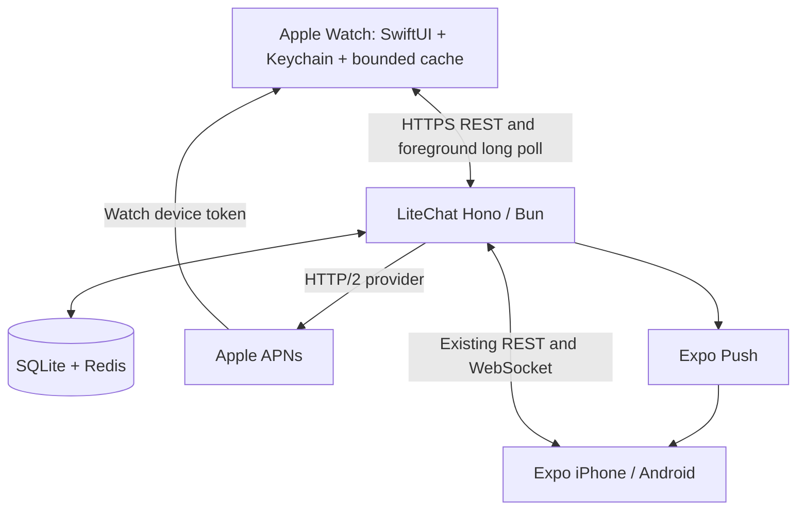

# Independent LiteChat for Apple Watch

Status (2026-09-10): core implementation and automated checks passed, including an
EAS simulator build and inspection of its embedded Watch app. This is **not yet
production-ready**: distribution signing, physical Watch independence, real APNs
delivery and TestFlight remain unverified release blockers.

## Architecture audit (2026-09-09)

LiteChat is a Bun 1.3.14 monorepo. The Expo SDK 57 / React Native 0.86 / Expo Router
phone app uses SecureStore bearer sessions, TanStack Query, WebSocket updates and REST
fallback. Web and Lite share the Hono backend and compact `@litechat/types` models.
The backend is one Bun process behind Dokploy/Traefik, with SQLite WAL for accounts,
conversations, messages, read watermarks, images and notification records. Redis 7
stores 30-day sliding sessions and rate limits; Redis is intentionally nonpersistent.
Conversations are created by friend acceptance, not message sending. ChatService
enforces membership and blocking, validates content, and supplies REST and WebSocket
clients. Message IDs are globally increasing. Quotes are separate truncated records.
Images require authenticated access. Current pushes use Web Push and Expo Push; the
existing offline hook depends on recipient WebSocket presence. It cannot be the gate
for independent Watch push. Read-only changes currently travel only over WebSocket.



No WatchConnectivity bridge or pairing is included in v1. No phone session is copied.
The Watch source and configuration live in `apps/app/targets/litechat-watch`, outside
generated `ios/`. watchOS 10 is the minimum. Failed/offline sends persist for explicit
retry; they are never automatically sent hours later. Swift code requires a native
build; EAS Update only continues to update the companion JavaScript runtime.

## Primary documentation and decisions

- [Expo SDK 57](https://docs.expo.dev/versions/v57.0.0/): preserve SDK 57 and use its
  native dependency versions; Xcode 26.4 or newer is required by this SDK.
- [Independent apps](https://developer.apple.com/documentation/watchos-apps/creating-independent-watchos-apps):
  retain companion `kr.moveto.litechat`, enable `WKRunsIndependentlyOfCompanionApp`,
  and do not set `WKWatchOnly`. Installation and runtime independence are distinct
  from initial Apple Watch system setup and TestFlight distribution.
- [Single-target apps](https://developer.apple.com/documentation/watchos-apps/migrating-to-a-single-target-watchos-app):
  one SwiftUI watchOS app target, WKApplication APIs, no separate WatchKit extension.
- [Watch authentication](https://developer.apple.com/documentation/watchos-apps/authenticating-users-on-apple-watch):
  account apps must support creating accounts and signing in on Watch. Include native
  username/password/nickname registration and username/password login.
- [Account deletion](https://developer.apple.com/support/offering-account-deletion-in-your-app/):
  include minimal password-confirmed deletion because registration is supported.
  This is the sole account-management exception; no friends/search/profile/admin UI.
- [TN3135](https://developer.apple.com/documentation/technotes/tn3135-low-level-networking-on-watchos):
  URLSession HTTPS is supported for general apps; WebSockets are low-level networking
  and are not appropriate for this messaging app. Simulator is insufficient evidence.
- [URLSession](https://developer.apple.com/documentation/foundation/urlsession):
  ephemeral authenticated async requests, finite timeouts, cancellation and no cookie
  or credential persistence outside Keychain.
- [Direct Watch notifications](https://developer.apple.com/documentation/watchos-apps/enabling-and-receiving-notifications):
  register on Watch and send to both companion and Watch destinations. Verify alert
  coordination on physical hardware; Expo translation may affect payload equivalence.
- [Registration](<https://developer.apple.com/documentation/watchkit/wkapplication/registerforremotenotifications()>):
  register at every launch, send the returned token directly to the server, never
  assume a cached device token is current. Request UNUserNotificationCenter permission.
- [APNs requests](https://developer.apple.com/documentation/usernotifications/sending-notification-requests-to-apns)
  and [token authentication](https://developer.apple.com/documentation/usernotifications/establishing-a-token-based-connection-to-apns):
  HTTP/2, ES256 provider JWT, Watch bundle topic, alert push type, priority 10;
  provider acceptance is not proof of visible delivery.
- [Apple targets source](https://github.com/EvanBacon/expo-apple-targets): audited
  published `@bacons/apple-targets` 5.0.0. It creates modern watch targets and EAS
  credential declarations but does not enable independent running by default.
- [CNG](https://docs.expo.dev/workflow/continuous-native-generation/) and
  [EAS additional targets](https://docs.expo.dev/build-reference/app-extensions/):
  checked-in configuration is authoritative; inspect clean prebuild and archive.
- [EAS Submit](https://docs.expo.dev/submit/ios/) and
  [Watch store metadata](https://developer.apple.com/help/app-store-connect/create-an-app-record/add-watchos-app-information):
  retain App Store Connect app 6787369837 and submit the containing iOS archive.

## Implementation sequence

1. Add isolated Watch authentication, revocable session metadata and narrow routes.
2. Add ChatService-backed messages, read state, idempotent sends and bounded waiters.
3. Add Watch APNs registration, durable dispatch/retry and canonical notifications.
4. Build SwiftUI authentication/chat, Keychain, networking, cache and notification routing.
5. Generate target with CNG, test contracts and inspect generated configuration.
6. Run existing checks, native/EAS builds, archive checks and physical release matrix.

## Release evidence required

Run development, preview, then production EAS iOS builds and inspect each artifact.
Verify Watch app embedding, bundle IDs, versions, independent-run plist, Watch icons,
watchOS deployment floor, Push capability and actual signed `aps-environment` against
the provisioning profile. Internal distribution may use production APNs: never infer
the APNs environment from a profile's name or DEBUG alone.

Submit production with `eas submit --platform ios --profile production`. Add Watch
screenshots, description, privacy disclosures, support and reviewer instructions to
the existing listing. Test installation through TestFlight, then standalone runtime.

Physical matrix (owner has Mac and cellular Watch available; all currently NOT RUN):

| Scenario                         | Required observations                                                        |
| -------------------------------- | ---------------------------------------------------------------------------- |
| A: iPhone powered off            | Launch, login, history, send/receive/read, background APNs, notification tap |
| B: iPhone far away               | Full flow without Bluetooth                                                  |
| C: Watch cellular only           | Wi-Fi off, iPhone unavailable, full flow                                     |
| D: Watch Wi-Fi only              | Cellular off, iPhone unavailable, full flow                                  |
| E: phone LiteChat terminated     | Watch behavior unchanged                                                     |
| F: Watch session revoked         | Watch-native reauthentication and chat                                       |
| G: Watch app inactive/terminated | Real server → APNs → Watch alert with iPhone powered off                     |
| Companion uninstalled            | Independent installation/runtime where Apple permits                         |
| Multi-day isolation              | Session persistence, network transitions, catch-up and explicit retry        |
| Both devices available           | Compare alert coordination locked/unlocked, same canonical message           |

Record build ID, hardware/OS, network, timestamps, APNs request ID, visible result and
notification destination. Never record credentials or full device tokens. Measure
launch/content/send/receive latency, requests, cache size, image memory and reconnect
behavior. APNs success, Simulator push and phone-forwarded push do not pass scenario G.

The final engineering report must distinguish implemented, automatically tested,
EAS verified, physical Watch verified and TestFlight verified. Until A and G pass on
physical hardware, this feature must not be described as production-ready.

## Implemented server contract

All authenticated Watch requests use `Authorization: Bearer w_<random>` under
`/api/watch`. Phone/web sessions are rejected here; Watch tokens never enter the
existing `sess:` namespace and cannot authenticate general REST or WebSocket routes.

| Method | Path below `/api/watch`       | Contract                                                             |
| ------ | ----------------------------- | -------------------------------------------------------------------- |
| POST   | `/auth/login`                 | Existing username/password → `{user,token}`; no cookie               |
| POST   | `/auth/register`              | Existing registration validation, including nickname → Watch session |
| GET    | `/auth/me`                    | Minimal `PublicUser`                                                 |
| POST   | `/auth/logout`                | Revoke this session and remove its APNs association/jobs             |
| DELETE | `/auth/account`               | Password-confirmed account deletion; policy exception                |
| GET    | `/conversations`              | Existing `ConversationSummary[]`                                     |
| GET    | `/conversations/:id/messages` | `{messages,refs?,acks?,read,peerRead}`                               |
| POST   | `/conversations/:id/messages` | `{i:UUID,k:text-or-emoji,x,r?}` → `{i,message}`                 |
| POST   | `/conversations/:id/read`     | `{m}` → existing watermark result                                    |
| GET    | `/images/:id/thumb`           | Authenticated existing image service; no original/upload route       |
| POST   | `/push/register`              | `{token,environment:'sandbox'                                        | 'production'}`; session owns association |
| DELETE | `/push/register`              | Remove only this Watch session's registration                        |

Message queries accept mutually exclusive `before`/`after`, `limit` (default 30,
maximum 50), `wait` (0–25 seconds; requires `after`), and last observed `pr`/`mr`
watermarks. The Watch normally waits 20 seconds. Changes from existing REST and WS
ChatService callers wake the same waiters. Subscribe-before-query prevents lost
wakeups; membership and authentication are rechecked after wake. Timeouts return JSON.
Cancellation, logout and shutdown release waits. Limits: one wait/session, four/user,
1,000/process; authenticated requests are limited to 120/minute/session. Login and
registration share the existing IP rate-limit budgets. Watch request bodies are 8 KiB
maximum. Bun HTTP idle timeout is 40 seconds; the prior WebSocket timeout is unchanged.
Confirm the deployed reverse proxy allows at least 40 seconds for HTTP responses.

`acks` maps the sender's own Watch request UUIDs to canonical IDs. A unique SQLite
index enforces persistent retry identity per sender. Reusing a UUID with different
content/conversation is 409. The client never relies on matching text/timestamps.
Existing `WireMessage`, `WireQuote` and image semantics remain intact. “전송됨” means
server-accepted, not proof of recipient delivery; read state uses the peer watermark.

Watch session tokens contain 256 random bits. Only SHA-256 identifiers go into
`watch_sessions` and Redis `watchsess:` keys. Metadata records user, platform,
creation/activity/expiry and revocation. Redis retains the existing sliding-expiry
philosophy (30 days by default); no phone participates in renewal. SQL revocation is
checked after Redis awaits, preventing authentication from resurrecting a revoked
session. Redis loss requires standalone Watch sign-in. Global revocation and account
deletion also revoke Watch sessions. On-device tokens use non-synchronizing,
WhenUnlockedThisDeviceOnly Keychain storage. Password fields clear after submission.

## Direct APNs and operations

`watch_push_tokens` is separate from Expo tokens. Registrations are session-scoped,
up to ten/account, and cannot claim another user's association. Same-token refresh
and token rotation preserve pending delivery jobs. Logout removes the registration;
offline logout retains a revocation-only credential in Keychain for a later attempt.
Tokens themselves are obtained from APNs at launch, not persisted on Watch.

`watch_push_jobs` is inserted in the same SQLite transaction as the message. The
single-process worker resumes pending jobs at startup, dispatches immediately for new
messages, and checks due retries every five seconds on the **server**. Jobs expire
after 24 hours. Transient errors use bounded exponential jitter with six total
attempts; terminal failures retain a reason until retention removes the job.
Acceptance is recorded as `accepted`, never “delivered”. Watch jobs are separate
from existing per-device `notification_log` rows so its delivery-ACK semantics and
existing dashboards remain unchanged.

APNs uses pooled `node:http2` connections, ES256 JWTs reused for 50 minutes, 10-second
request deadlines, Watch topic `kr.moveto.litechat.watch`, `alert`/priority 10 and a
message-specific collapse ID. BadDeviceToken/Unregistered remove only the matching
registration; timestamp and token-generation checks protect newer registrations.
Provider/authentication errors do not prune valid devices. No provider error logs
contain full tokens, private keys or passwords.

Supply these only through backend/Dokploy secrets:

- `WATCH_APNS_TEAM_ID`
- `WATCH_APNS_SANDBOX_KEY_ID`, `WATCH_APNS_SANDBOX_PRIVATE_KEY`
- `WATCH_APNS_PRODUCTION_KEY_ID`, `WATCH_APNS_PRODUCTION_PRIVATE_KEY`
- `WATCH_APNS_TOPIC` (defaults to `kr.moveto.litechat.watch`)

Private keys are .p8 PEM contents; escaped newlines are accepted. Environment-specific
keys are supported. A legacy key that supports both environments can be supplied in
both configurations. Never put these values in Expo public variables or repository
files. Configure the Watch App ID's Push capability in the Apple Developer account.

The canonical notification builder supplies sender title, the existing 80-character
safe preview (image placeholder), conversation ID, message ID, category and thread
for Expo and Watch. Web Push keeps its existing offline behavior. Accounts with a
registered Watch fan out to Expo and Watch even if another device's socket is online.
Accounts without a Watch retain existing Expo suppression behavior. Failures in one
provider do not stop the other provider. Expo still adds provider-specific receipt
metadata (`n`) and transforms the native payload. Exact native equivalence and alert
coordination are therefore **not verified**; the real-device duplicate-alert matrix
is a release gate. Direct Watch delivery must never be disabled to work around it.

## Native lifecycle, cache and CNG

`WatchAPIClient` uses ephemeral URLSession HTTPS with no persistent cookie/credential
storage and rejects redirects. Ordinary requests time out in 15 seconds and polls in
35 seconds. Poll cancellation follows scene/conversation/network lifecycle, with
jittered reconnect delay capped at 60 seconds. No background keepalive, sockets,
WatchConnectivity imports, React renderer, custom keyboard or photo upload exists.

`WatchModel` handles identity, chat reconciliation, explicit retries and notification
navigation. Cache uses an atomic, file-protected JSON file excluded from backups:
100 conversation summaries, ten recent chats × 100 messages on disk, 200 visible
messages per chat and 50 pending sends, with a 4 MiB file cap. The first release exposes
up to 200 recent messages in an open chat; older pages load in batches of 30. Cached
quotes remain separate from full messages. Thumbnail requests use the existing
thumbnail endpoint, downsample to 320 pixels and bound compressed memory caching.
There is no persistent full-resolution image cache.

Native system fields provide watchOS keyboard/Dictation/Scribble/emoji where available.
Account and message content are not sent through a phone keyboard requirement.
Swift package model tests live outside the app target so XCTest is not embedded.

The local config plugin runs before apple-targets registration, then applies its Xcode
changes after the target is generated. React Native's CocoaPods privacy aggregation
adds the iOS privacy manifest to every application target; a targeted post-install
cleanup removes that extra Watch resource, preserving the Watch's own manifest.

The client APNs environment is embedded as `LiteChatAPNsEnvironment`: local Debug
uses sandbox, local Release uses production, current EAS ad-hoc/store profiles use
production. This is a build-time contract, not proof of signing: the archive verifier
must compare it with actual signed `aps-environment`. No private SecTask APIs are used.
The target's development entitlement is re-signed for distribution by provisioning.
If changing signing/distribution strategy, update this contract and verify the archive.

From `apps/app`:

```sh
npx expo config --type prebuild
npx expo prebuild --clean -p ios
node scripts/sync-watch-version.cjs
node scripts/verify-watch-config.cjs
swift test
# macOS, after clean prebuild and CocoaPods installation:
xcodebuild -workspace ios/litechat.xcworkspace -scheme LiteChatWatch -sdk watchsimulator -configuration Debug CODE_SIGNING_ALLOWED=NO build
# EAS uses the containing iOS scheme:
eas build --platform ios --profile development
eas build --platform ios --profile preview
eas build --platform ios --profile production
python3 scripts/verify-watch-archive.py /path/to/export.ipa
eas submit --platform ios --profile production
```

`watch-simulator` is an additional unsigned cloud compilation profile. It cannot
validate remote APNs, provisioning or real Watch networking. Source/entitlement/icons
changes require EAS Build. Existing EAS Update configuration remains in place.

## TestFlight runbook

TestFlight distributes the Watch app inside the signed iOS archive; there is no separate
watchOS upload and no additional App Store Connect record. `production` is the TestFlight
profile: it is App Store distribution, and every store build reaches testers through
TestFlight before release. Building and submitting run in EAS's cloud macOS workers, so
the sequence below works from this Linux workspace; only `verify-watch-archive.py`
requires a Mac. No new EAS profile is needed.

### Version parity

Apple requires a Watch app's `CFBundleVersion` and `CFBundleShortVersionString` to equal
its companion's, and App Store Connect rejects a mismatched archive (ITMS-90473) after the
build already succeeded. `appVersionSource` is `remote` with `autoIncrement`, and EAS
applies that build number to the companion alone, which
[expo/expo#43740](https://github.com/expo/expo/issues/43740) tracks upstream. Three
checked-in pieces close it: the config plugin applies the resolved build number to the
Watch target during generation, `scripts/sync-watch-version.cjs` re-mirrors the
companion's generated version inside the iOS post-install hook — which EAS runs after
prebuild and CocoaPods, before compiling — and `verify-watch-config.cjs` fails the build
when the two disagree instead of letting the upload be rejected.

### One-time Apple and server setup

Credentials cannot be created noninteractively, which is what stopped the earlier
development build. Run once, from `apps/app`:

```sh
eas login
eas credentials --platform ios   # App Store distribution, for both targets
```

`extra.eas.build.experimental.ios.appExtensions` already declares
`kr.moveto.litechat.watch` and its `aps-environment` entitlement, so EAS provisions both
bundle identifiers and enables Push on the Watch App ID. Adding `ios.appleTeamId` to
`app.json` silences the apple-targets warning and is required only for local Xcode
archives, not for EAS.

TestFlight builds use **production** APNs. `WATCH_APNS_TEAM_ID`,
`WATCH_APNS_PRODUCTION_KEY_ID` and `WATCH_APNS_PRODUCTION_PRIVATE_KEY` must exist in the
deployed backend; the sandbox pair only serves local Debug builds. The deployment must
already expose `/api/watch`.

### Build, submit, install

```sh
eas build --platform ios --profile production --auto-submit
# or, for an existing build: eas submit --platform ios --profile production
```

Export compliance is pre-answered by `ITSAppUsesNonExemptEncryption` in both bundles.
After processing, add the build to a TestFlight internal group. Write “what to test”
instructions that cover Watch sign-in, because the Watch app authenticates on its own.

Testers install the iPhone build from TestFlight first: this app is not `WKWatchOnly`, so
the watchOS TestFlight app cannot install it directly. The Watch app then arrives through
the iPhone's Watch app — automatically with Automatic App Install on, otherwise from
Available Apps. After that, sign in on the Watch under “계정 및 알림” and run the physical
matrix above; powering the iPhone off is what distinguishes independence from forwarding.

Optionally download the `.ipa` from the build page and inspect it on a Mac before
releasing to a wider group:

```sh
python3 scripts/verify-watch-archive.py /path/to/build.ipa
```

TestFlight verifies signed distribution, installation and production APNs. It does not
establish that the companion may be absent, which Apple's Watch installation flow still
requires; record that separately.

## Verification record (2026-09-09)

- Watch backend suite: **35 passed**, covering direct password authentication,
  scope isolation, expiration/global revocation/deletion, conversation access,
  paging/images/read state, idempotent send, poll wake/timeout/cancellation/limits,
  device registration/rotation/isolation, durable retries and invalid-token cleanup.
- The zero-Expo-token test verifies Watch dispatch even when a phone socket is online.
  It proves server fan-out, **not** APNs delivery to hardware.
- APNs transport test uses a real local HTTP/2 server and a generated test EC key to
  verify headers, ES256 signature and rejection parsing. No Apple credentials are used.
- `watch-build-checks.cjs` rejects WatchConnectivity/WebSocket source dependencies;
  the iOS EAS post-install hook also runs generated-target checks and Swift core tests.
  See [Expo build lifecycle hooks](https://docs.expo.dev/build-reference/npm-hooks/).
- Clean CNG generation and generated target verifier passed on Linux with
  `npx expo prebuild --clean -p ios --no-install`. CocoaPods/native compilation run
  in EAS's macOS environment, not this Linux workspace.
- EAS development signing attempt stopped before compilation because internal
  distribution credentials were unavailable in noninteractive mode. Configure Apple
  credentials interactively for both bundle IDs, then rerun development → preview →
  production. Preview/production/Submit have not passed and are not inferred from a
  simulator build.
- Simulator build `53d4161a-7306-403b-868f-e56aee620347` exposed a duplicate privacy
  resource caused by React Native CocoaPods aggregation. The CNG post-install fix
  removes the duplicate Watch copy; build `423aa068-88ef-4911-893e-9d8112bee253`
  subsequently completed successfully. Final source build and artifact inspection
  are recorded below.

## Remaining release work

1. Configure backend APNs secrets and deploy the additive schema/server changes with
   normal database backup and rollout procedures. Inspect job outcomes without logging
   token values. Do not test against an old backend that lacks `/api/watch` routes.
2. On the Mac, complete EAS signing for the iOS and Watch App IDs, with Push enabled
   on the Watch profile. Run `verify-watch-archive.py` on every distribution artifact;
   it checks signed entitlements, profile agreement and embedded Watch metadata.
3. Install on the physical Watch, allow notifications from “계정 및 알림”, and execute
   the complete matrix above. Capture real server → APNs → Watch evidence with the
   iPhone powered off before considering production release.
4. Add Watch screenshots and metadata to the existing App Store Connect application,
   confirm Watch privacy disclosures, provide a review account with an existing
   conversation, and explain direct sign-in/account creation and independent use in
   review notes. Submit the containing archive and test Watch installation through
   TestFlight. Record separately whether the companion can be absent in that channel.
5. Measure physical launch/content/receive/send/APNs latency, network request counts,
   cache size and thumbnail memory under Wi-Fi/cellular/offline transitions. No
   hardware performance numbers have been measured in this workspace.

Known limits: watchOS 10+, text/emoji sending, thumbnail receiving, up to 200 recent
messages visible per open conversation, ten cached chats, explicit failed-send retry,
no optional pairing or quick reply. Long-poll waiters assume the existing single Bun
process; a multi-process deployment needs shared wakeup coordination. Expo/APNs native
payload differences still require physical duplicate-alert testing. Future work may
add optional one-time pairing, deeper paged history and quick reply after the base
independence gates pass.

## Engineering change inventory

Created:

- `apps/server/src/modules/watch/{routes,session,waiters,push,apns}.ts` and four
  corresponding test files; `modules/push/message-notification.ts`.
- `apps/app/targets/litechat-watch/`: SwiftUI entry point, views, compact models,
  API client, application state, Keychain/cache stores, notification delegate,
  target configuration, Info.plist, privacy manifest and icon assets.
- `apps/app/plugins/with-litechat-watch.js`, `scripts/verify-watch-config.cjs`,
  `scripts/verify-watch-archive.py`, `scripts/watch-build-checks.cjs`, `Package.swift`
  and `watch-tests/WatchCoreTests.swift`.
- This architecture, operations and release-evidence document.

Modified:

- Server app/dependency/lifecycle configuration, additive SQLite migration and
  retention, global session revocation, shared ChatService and Expo notification
  derivation; Docker Compose secret configuration.
- Expo plugins/dependencies, EAS simulator profile, build checks, Swift build-product
  ignore rule and Bun lockfile. Existing phone routes, WebSocket implementation,
  Android/Web/Lite features, EAS Update and submit profile remain available.

Automatically tested on this revision: TypeScript checks **7 packages passed**,
configured lint **passed**, server **183 tests passed**, Expo app **77 tests in 11
suites passed**, target configuration and source independence **passed**. Existing
Jest act/worker teardown warnings remain; there were no failing application tests.
The final APNs test annotation correction was rechecked with TypeScript and its
HTTP/2 test.

Security review: Watch credentials occupy a distinct namespace and contain 256 bits
of randomness; only hashes reach SQLite/Redis keys. Durable revocation is checked
following Redis awaits. Standalone login does not issue or accept a phone credential.
All Watch routes enforce their own session boundary; chat/image access reuses existing
authorization. Passwords are cleared from native input state after authentication;
session credentials and offline revocation credentials are Keychain-only. Generation
checks discard late chat responses after account changes. Push tokens require the
current Watch session and cannot claim another user's token. Account deletion/global
revocation remove Watch access. APNs keys remain backend secrets. Poll slots, durations,
request rates, body sizes, disk history and thumbnail memory are bounded.

## Final cloud verification (2026-09-10)

[EAS build e34bce5c-d0cd-487c-bdbc-9d85d4dc5c19](https://expo.dev/accounts/jhyunwoo/projects/litechat/builds/e34bce5c-d0cd-487c-bdbc-9d85d4dc5c19)
finished successfully using `watch-simulator`. Its macOS post-install hook passed
source-independence checks, generated-target checks and **three Swift core tests**.
Both the containing iOS application and native Watch target compiled successfully.

The downloaded simulator artifact was inspected, not just its green build status:

| Artifact property | Observed value |
| --- | --- |
| Embedded app | `litechat.app/Watch/LiteChatWatch.app` |
| Watch bundle ID | `kr.moveto.litechat.watch` |
| Companion bundle ID | `kr.moveto.litechat` |
| Independent run | `WKRunsIndependentlyOfCompanionApp = true` |
| Watch-only flag | Absent |
| Minimum watchOS | `10.0` |
| Versions | Watch and iOS both `1.0.0` / build `1` in this simulator artifact |
| Server URL | `https://chat.moveto.kr` |
| APNs build environment | `production` (current EAS distribution contract) |
| Native resources | Watch executable, `Assets.car`, own privacy manifest present |

This simulator artifact has **no verified distribution provisioning**. Its configured
APNs environment is not evidence of a signed production entitlement or a remote push.
No Watch simulator was launched interactively in this Linux workspace.

| Delivery stage | Verification status |
| --- | --- |
| Implementation | Core Watch/server/CNG paths implemented |
| Automated tests | TypeScript, lint, 183 server + 77 app + 3 Swift tests passed |
| Clean native generation | Passed locally; EAS prebuild/CocoaPods/build passed |
| EAS simulator artifact | Build and embedded Watch metadata inspected |
| EAS development device build | Blocked before build: missing distribution credentials |
| EAS preview / production | Not verified; signing setup required |
| Signed archive / APNs entitlement | Not verified; macOS verifier provided |
| Physical Wi-Fi / cellular | Not run |
| iPhone powered off / out of range | Not run |
| Real direct APNs alert and conversation tap | Not run; release blocker |
| TestFlight / EAS Submit | Not run; signed distribution build required |

The owner has indicated access to a Mac and cellular Watch, but no remote Mac runner,
physical-device results or APNs secret configuration was supplied to this workspace.
Those inputs are required to execute the remaining gates. No physical-device,
TestFlight, notification coordination or battery-performance success is claimed.

## Production rollout instruction (2026-09-10)

The owner explicitly requested production deployment while skipping further
verification. This supersedes the requirement to wait for physical testing before
initiating rollout; it does not change the recorded test results or establish
production readiness. No additional physical/device validation was performed.
Production EAS Build with automatic App Store Connect submission was requested,
and the implementation is being published to the documented Dokploy source branch
`main`. APNs secrets must still exist in the backend environment for direct delivery.
